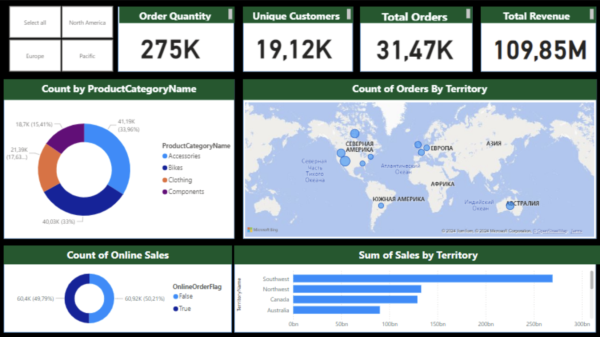
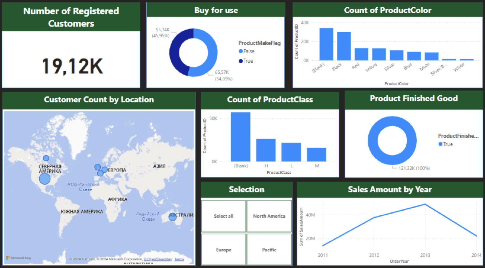
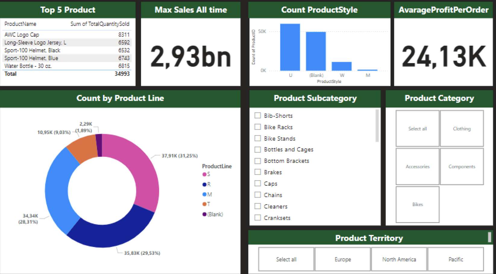

# AdventureWorks2022 Dashboard Project in PowerBi

## Dashboard Preview
### Dashboard 1-page

### Dashboard 2-page

### Dashboard 3-page

## Overview

This project showcases a comprehensive **Sales Dashboard** created using Power BI. The dashboard provides an insightful view of the key metrics related to sales, customer behavior, and product performance across different regions and categories.

## Features

The dashboard is divided into three key pages, each offering different perspectives on the sales data:

### Page 1: Sales Summary
- **Order Quantity:** 275K
- **Unique Customers:** 19.12K
- **Total Orders:** 31.47K
- **Total Revenue:** 109.85M
- Visualizations:
  - **Product Category Breakdown:** A pie chart showing sales distribution across categories like Accessories, Bikes, Clothing, and Components.
  - **Sales by Territory:** A map view highlighting the number of orders across different global regions.
  - **Online Sales Count:** A breakdown of online versus offline sales.

### Page 2: Customer Insights
- **Number of Registered Customers:** 19.12K
- **Customer Count by Location:** A geographical map displaying the concentration of customers.
- **Product Breakdown:**
  - Count by **Product Color**
  - Count by **Product Class**
- **Yearly Sales Trend:** A line chart showing the sales trend from 2011 to 2014.

### Page 3: Product Performance
- **Top 5 Products Sold:** Lists the highest-selling products with total quantity.
- **Max Sales:** Total sales amount of 2.93bn.
- **Product Style & Subcategory Breakdown:** A bar chart showing product sales by style and subcategory.
- **Profit per Order:** 24.13K average profit per order.
- **Product Sales by Line and Territory:** Visual representation of sales performance across different product lines and regions.

## Installation

To view this dashboard:
1. Clone this repository to your local machine.
2. Ensure you have [Power BI Desktop](https://powerbi.microsoft.com/) installed.
3. Open the `.pbix` file in Power BI Desktop to explore the visuals and data insights.

## Usage

The dashboard provides valuable insights into:
- Product-wise performance
- Regional sales distribution
- Online vs. offline sales
- Customer demographics and preferences
- Profitability and overall sales trends

Feel free to use this dashboard as a starting point for your own sales analytics projects!

## License

This project is licensed under the MIT License - see the [LICENSE](LICENSE) file for details.

## Contact

For any queries or suggestions, feel free to reach out via the Issues tab or contribute directly by opening a Pull Request.

